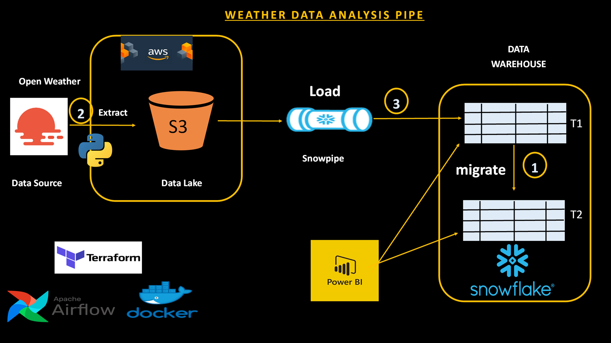

# WEATHER DATA ANALYSIS

Data collected in this project is for London and can be adjusted to suit needs.

## PROJECT OVERVIEW

The WEATHER DATA ANALYSIS System is designed to support business decision-making by collecting, storing, and analyzing weather forecast data and historical weather forecast data, specifically for London. This system automates the process of fetching weather data from OpenWeather, persisting it in Amazon S3, and storing it within a dedicated forecast data table. Once the forecast data expires, it is moved into a table dedicated to store historical weather forecast data in the data warehouse. The primary goal of this project is to provide actionable insights from both current forecast data and historical weather data. These insights will help optimize operations, improve planning, and enhance overall business performance.




## Data Description

This project utilizes weather forecast data from OpenWeather. The dataset contains weather predictions for London, covering a period of five days from the date of extraction. The data is updated regularly and provides a comprehensive view of the weather conditions expected in the near future. Below are the descriptions of the fields included in the dataset:

- DATETIME: The date and time when the weather forecast was recorded.
- DAY_NAME: The name of the day (e.g., Monday, Tuesday) corresponding to the forecast.
- MONTH_NAME: The name of the month during which the forecast is made.
- TEMPERATURE: The predicted temperature in degrees Celsius.
- FEELS_LIKE: The "feels like" temperature in degrees Celsius.
- DESCRIPTION: A textual description of the weather conditions.
- PRESSURE: The atmospheric pressure in hectopascals.
- HUMIDITY: The relative humidity as a percentage.
- WINDSPEED: The speed of the wind in meters per second.
- WIND_DIRECTION: The direction from which the wind is blowing, in degrees.
- CLOUDINESS: The percentage of cloud cover in the sky.
- PRECIPITATION: The amount of precipitation (rainfall) expected, measured in millimeters.

This dataset is crucial for analyzing weather trends, understanding the impact of weather on various activities, and making informed business decisions based on weather forecasts.

## Usefulness Of Project In Some Target Industries

The weather forecast data collected from OpenWeather is of paramount importance to various businesses, particularly those whose operations and strategies are highly dependent on weather data. Below are some targeted industries where this project is relevant:

1. Agriculture
   - **Crop Planning:** Use temperature, humidity, and precipitation data to decide the best times for planting and harvesting, ensuring optimal   crop yield.
   - **Pest and Disease Control:** Plan for potential pest infestations that might increase with certain weather conditions, such as high humidity or temperature changes.
   - **Irrigation Management:** Adjust irrigation schedules based on precipitation forecasts to conserve water and ensure crops receive adequate hydration.

2. Clothing and Apparel Industry
   - **Seasonal Inventory Management:** Utilize temperature and weather descriptions to predict demand for seasonal clothing, such as jackets in colder weather or lighter apparel during warm periods.
   - **Marketing and Promotions:** Align promotional campaigns with the forecast, such as discounts on rain gear during expected precipitation periods or summer collections during warm weather forecasts.
   - **Production Planning:** Schedule production runs for seasonal clothing items based on weather forecasts, ensuring timely availability of high-demand items.

3. Supply Chain and Logistics
   - **Stock Management:** Adjust inventory based on weather forecasts to meet expected demand for specific products, ensuring sufficient stock during peak demand periods.
   - **Delivery and Logistics:** Optimize delivery routes and schedules by considering wind speed, precipitation, and other weather conditions to avoid delays and ensure timely delivery.
   - **Fleet Management:** Prepare vehicles for expected weather conditions, ensuring maintenance and readiness for adverse weather to minimize disruptions.
   - **Warehouse Operations:** Adjust warehouse operations, such as heating and cooling systems, based on temperature and humidity forecasts to maintain optimal storage conditions.


## Analysis

The analysis of this data provides actionable insights that can help businesses optimize their operations and strategic planning. Here are some key analyses that have been performed:

1. Temperature Trends
   - Objective: Determining average daily temperature and how it changes over the forecast period.
   - Analysis: A plot of temperature and feels-like temperature to observe trends and anomalies.

2. Weather Conditions Frequency
   - Objective: Determining the frequency of different weather conditions.
   - Analysis: A bar chart to visualize the distribution of weather descriptions.

3. Correlation Analysis
   - Objective: Understanding the relationship between different weather variables.
   - Analysis: A correlation heatmap to identify significant correlations.

4. Impact on Humidity and Cloudiness
   - Objective: Analysis on how humidity and cloudiness vary with time.
   - Analysis: A plot of these variables to observe trends and potential impacts on outdoor activities and energy needs.

5. Precipitation and Wind Analysis
   - Analysis: Use trend lines and scatter plots to visualize the data and understand patterns.

6. Pressure Analysis
   - Objective: Determining atmospheric pressure trends to predict weather changes.
   - Analysis: Plot pressure data over time to observe trends and anomalies.


## DATA WORKFLOW

The London weather data is extracted from the OpenWeather API and persisted in Amazon S3, with each file saved using the datetime of extraction for version control and traceability. Snowpipe is configured to automatically load this data from S3 into a forecast table in Snowflake whenever a new file is uploaded to the specified S3 location. This ensures that the latest weather forecast data is continuously ingested into Snowflake. As the forecast data expires (typically after five days), a Python script is executed to migrate the expired data from the forecast table to a historical_forecast table in Snowflake, maintaining a clean and current forecast table while preserving historical data for analysis to see how weather has impacted business. Apache Airflow is employed to automate these processes: it schedules the periodic extraction of weather data, saves it to S3, and handles the migration of expired forecast data. For analysis and visualization, Python libraries such as Pandas and Matplotlib are utilized to perform initial data analysis, creating visualizations of trends and patterns. Additionally, Power BI is connected to the Snowflake tables to provide advanced, interactive visualizations. These tools offer business users insightful dashboards and reports, enabling them to make informed decisions based on the weather data. This streamlined workflow from extraction to analysis ensures that weather data is effectively managed and leveraged for business intelligence.


## Tools Used

1. Python with version 3.10.11: Used for extracting, processing, and analyzing weather data from the OpenWeather API.
2. Apache Airflow: Running on Docker, it automates data extraction, storage, and migration processes.
3. Docker: Provides a containerized environment for running Apache Airflow.
4. Amazon S3: Serves as the storage solution for weather data files with timestamped filenames.
5. Snowflake: Acts as the data warehouse, storing both weather forecast and historical weather forecast data.
6. Snowpipe: Automatically loads data from S3 into Snowflake table.
7. SQL: Used for defining and managing data within Snowflake.
8. Terraform: Terraform was used to create the s3 storage and the snowflake data warehouse


# USER GUIDE

1. Ensure all tools mentioned in the "Tools Used" section are in place, well-configured, and have the necessary access privileges.
   
2. Ensure all access keys and other credentials are available and securely stored. Required credentials include:
   - `AWS_ACCESS_KEY_ID`:  AWS access key ID
   - `AWS_SECRET_ACCESS_KEY`:  AWS secret access key
   - `API_KEY`:  OpenWeather API key
   - `s3_bucket`: Name of  Amazon S3 bucket
   - `s3_folder`: Name of the folder within the S3 bucket
   - `SNOWFLAKE_ACCOUNT`:  Snowflake account ID  eg.xxxxxx-yyyyyyyy
   - `SNOWFLAKE_USER`:  Snowflake username
   - `SNOWFLAKE_PASSWORD`:  Snowflake account password
   - `SNOWFLAKE_ROLE`:  Snowflake role
   - `SNOWFLAKE_WAREHOUSE`: Name of  Snowflake warehouse
   - `SNOWFLAKE_DATABASE`: Name of the Snowflake database
   - `SNOWFLAKE_SCHEMA`: Name of the Snowflake schema housing the weather data

6. Clone the repository:
    ```bash
    git clone https://github.com/princekwusu/Weather_Data_Pipeline.git
    ```

7. Navigate to the directory:
    ```bash
    cd Weather_Data_Pipeline
    ```

3. Terraform Setup:
     - Update `terraform.tfvars` with the neccessary credentials for creating the s3 storage and snowflake warehouse.
     - Run the following commands one by one:
      ```bash
      cd terraform
      ```
      ```bash
      terraform init
      ```
      ```bash
      terraform validate
      ```
      ```bash
      terraform plan
      ```
      ```bash
      terraform apply
      ```     

4. Copy and paste the content of `warehouse_dev.sql` into the Snowflake worksheet. Execute the scripts to create all tables and schemas.
   
5. Create an sqs event in the s3 file location using the `notification_channel`  value produced after describing the pipe in the warehouse.Use the command below to describe the pipe created.
   ```bash
   desc pipe weatherdata.weatherpipe.datapipe;
   ```

6.  Access `dags/src/.env` to update all the necessary credentials.
   
7.  Install the required packages.Ensure you are in the main project directory before running the command below.
    ```bash
    pip install -r requirements.txt
    ```

8.  Start the Airflow container:
    ```bash
    docker compose up -d
    ```
    Or follow this [link](https://airflow.apache.org/docs/apache-airflow/stable/howto/docker-compose/index.html) to see how to get Airflow running on Docker.

9.  Access the webserver at [http://localhost:8080](http://localhost:8080).
    
10. Login using the default credentials (Username: `airflow`, Password: `airflow`).
    
11. Trigger the DAG manually.
    
12. Monitor the Airflow UI for task execution and check logs for any errors.
    
13. Verify data ingestion in Snowflake tables using SQL queries:
    ```sql
    SELECT * FROM weatherdata.weather.forecast;
    SELECT * FROM weatherdata.weather.historical_forecast;
    ```

14. Considering the analysis, access `dags/src/analysis.ipynb` to execute the scripts in the cells or adjust the scripts to suite needs.


## CONCLUSION

In conclusion, the WEATHER DATA ANALYSIS project is a vital tool for any weather-dependent business. It harnesses the power of modern data engineering and analytics to transform weather forecasts data and historical weather forecast data into actionable business intelligence, driving smarter decisions and more efficient operations.

## CONTRIBUTION

Pull requests and suggestions are welcome. For major changes, please open an issue first to discuss what you would like to change.

## LICENSE

This project is licensed under the MIT License - see the [LICENSE](LICENSE) file for details.
